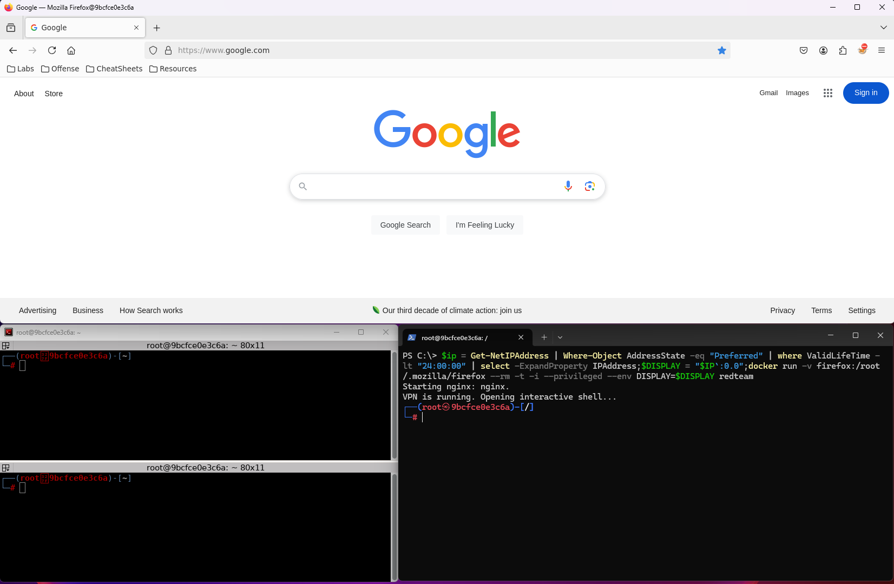

# TryHackMe AttackBox


[](https://opensource.org/licenses/)


This is a simple attackbox created using docker to help create a clean environment for learning on TryHackMe or HackTheBox.


## Screenshots



## Customizations
- nGinx server automatically starts with container.
- linpeas, winpeas, pspy automatically copied to webserver


## Preloaded Repositories

This machine comes stock with the following repositories, be sure to share some love.
```
https://github.com/Pennyw0rth/NetExec
https://github.com/RustScan/RustScan
https://github.com/Tib3rius/AutoRecon
https://github.com/s0md3v/XSStrike
https://github.com/DominicBreuker/pspy
https://github.com/peass-ng/PEASS-ng/
```

## Added functions in bashrc
```
nmap-initial() {
    nmap -O -sC -sV --top-ports 2000 "$1" | tee "/root/$1.txt"
}

ffuf-dirs() {
    ffuf -u "$1/FUZZ" -w /path/to/seclists/Discovery/Web-Content/common.txt | tee "/root/$1-dirs.txt"
}

ffuf-dir-quick() {
    ffuf -u "$1/FUZZ" -w /path/to/seclists/Discovery/Web-Content/directory-list-2.3-small.txt | tee "/root/$1-dirsq.txt"
}

ffuf-files() {
    ffuf -u "$1/FUZZ" -w /path/to/seclists/Discovery/Web-Content/all.txt | tee "/root/$1-files.txt"
}
```
## Prerequisites

You must have an X server such as MobaXterm or Xming running and listening for connections prior to launching the docker container.

## Customizing the container

Before you build the machine, you will want to copy your TryHackMe or HackTheBox ovpn configuration file to the VPN folder.

By default, the dockerfile will look for tryhackme.ovpn within the vpn folder, and copy the file to /root/tryhackme/connect.ovpn.

If you change the name of connect.ovpn, remember to also update vpn.sh and restart-vpn.sh

## Building the container

You can use anything you'd like for the tag of your machine (-t) but for this example, we're using redteam

While in the project directory run:
```powershell
docker build -t redteam .
```

## Running the container (PowerShell / Terminal)

The following command should automatically set and forward the local IP address of your computer for X11 forwarding.

```powershell
$ip = Get-NetIPAddress | Where-Object AddressState -eq "Preferred" | where ValidLifeTime -lt "24:00:00" | select -ExpandProperty IPAddress
$DISPLAY = "$IP`:0.0"
docker run -v firefox:/root/.mozilla/firefox --rm -t -i --privileged --env DISPLAY=$DISPLAY redteam
```

Oneliner:

```powershell
$ip = Get-NetIPAddress | Where-Object AddressState -eq "Preferred" | where ValidLifeTime -lt "24:00:00" | select -ExpandProperty IPAddress;$DISPLAY = "$IP`:0.0";docker run -v firefox:/root/.mozilla/firefox  --rm -t -i --privileged --env DISPLAY=$DISPLAY redteam
```
